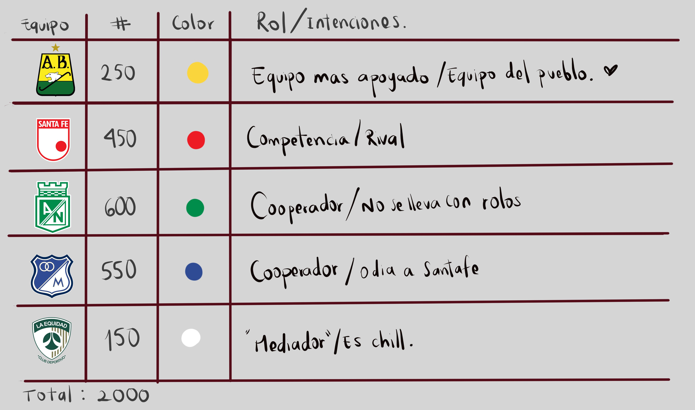
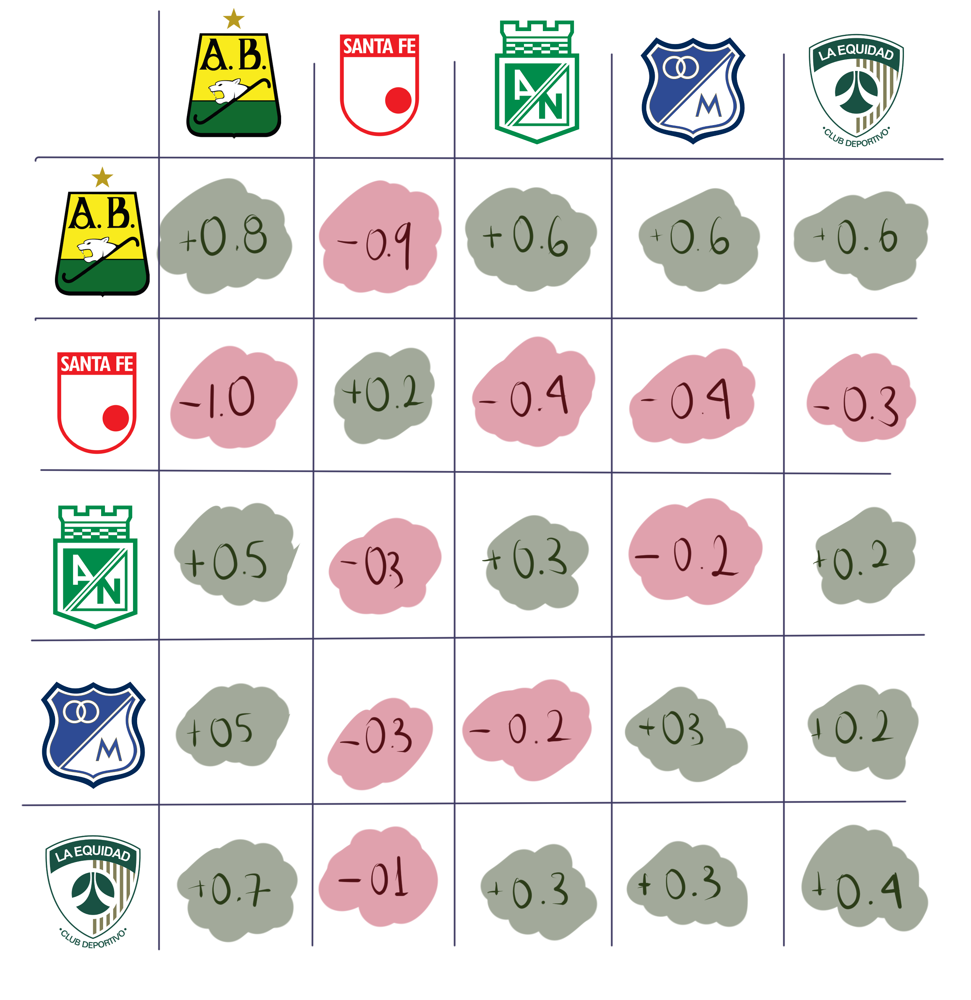
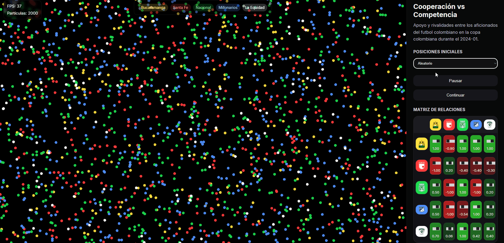
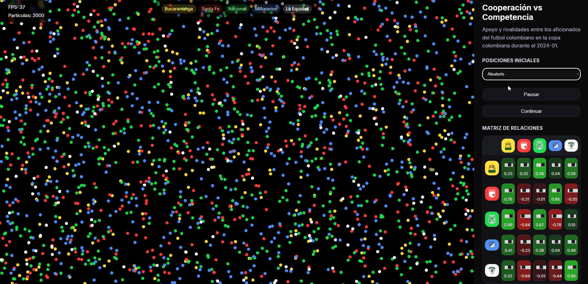
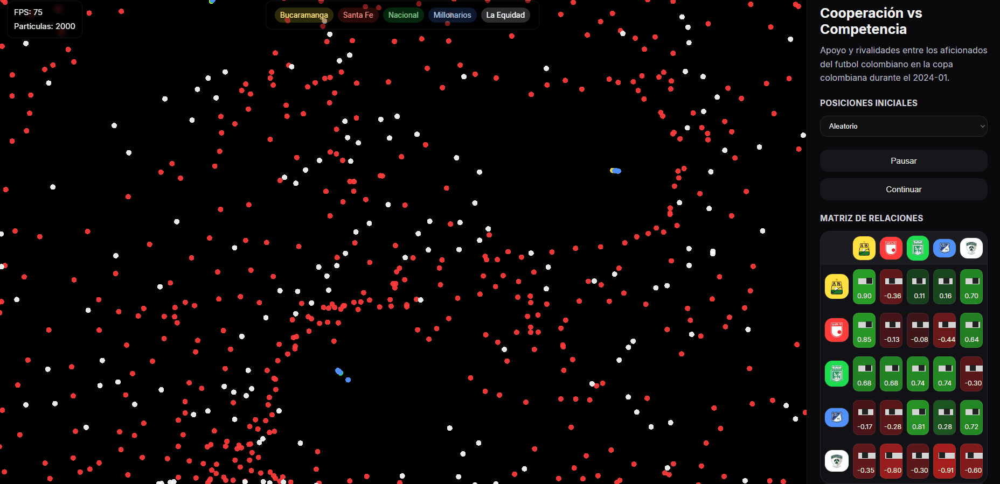
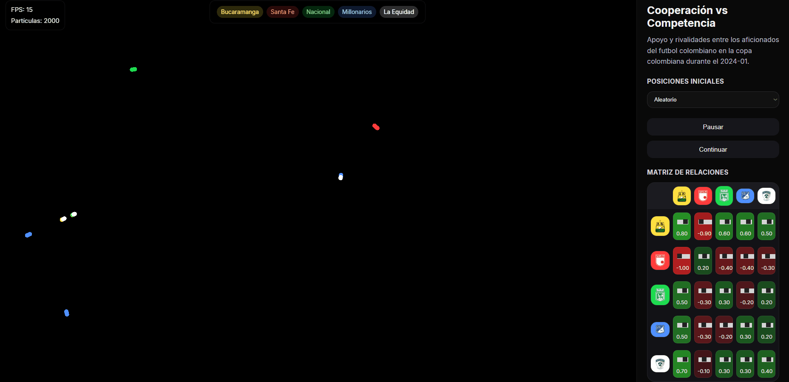

## Reto de Diseño - Unidad 2 / Movimiento

# Cooperación vs. Competencia: un sistema generativo inspirado en la final de la Liga BetPlay Apertura 2024

*Resultado: https://editor.p5js.org/Yepescadito/full/5Ac9WPKfJ*

# Intención

Quiero explorar la tensión entre la cooperación y la competencia.

La propuesta toma como inspiración la final de la Liga BetPlay Apertura 2024 entre Atlético Bucaramanga e Independiente Santa Fe. Más allá del resultado deportivo, el proyecto parte de la idea de que, incluso en un contexto altamente competitivo, pueden surgir alianzas temporales alrededor de un objetivo común. No pretende representar un partido de fútbol, sino utilizar esa situación como punto de partida para estudiar cómo comportamientos simples de atracción y repulsión pueden generar dinámicas complejas.

Espero que el sistema produzca momentos donde diferentes poblaciones colaboren para formar estructuras estables, mientras otra población intente romper constantemente esos grupos. De esta manera, la cooperación y la competencia coexistirán en un equilibrio cambiante donde ningún estado será permanente.

# Diseño del sistema

El sistema está compuesto por cinco poblaciones de partículas, cada una inspirada en un equipo del fútbol colombiano.

- __Tipos de partículas__ 

Seleccioné cinco poblaciones porque quería representar distintas formas de relacionarse dentro del sistema. En lugar de dividir únicamente entre cooperación y competencia, cada equipo cumple una función específica que enriquece los comportamientos emergentes.

- __Cantidad de partículas__ 

Asigné una mayor cantidad de partículas a Bucaramanga porque quiero hacer perceptible su papel como núcleo de cooperación. Espero que esto facilite la formación de agrupaciones visibles.
Santa Fe posee una cantidad alta de partículas para que la competencia tenga una influencia constante y sea capaz de desestabilizar los grupos cooperativos.
Las demás poblaciones tienen cantidades similares para mantener un equilibrio entre apoyo, mediación y competencia secundaria.

- __Relaciones__ 

Seleccioné una fuerte atracción entre Bucaramanga y los demás equipos porque quiero hacer perceptible la cooperación como una fuerza organizadora del sistema. Asigné una fuerte repulsión entre Santa Fe y Bucaramanga porque quiero representar la competencia como una fuerza capaz de romper agrupaciones estables. Entre Nacional, Millonarios y Equidad existen relaciones moderadas de atracción y repulsión para evitar que el sistema permanezca estático y permitir reorganizaciones constantes.

# Parámetros del sistema

El sistema utiliza los siguientes parámetros:

- Posición inicial aleatoria.
- Velocidad.
- Aceleración.
- Radio de interacción.
- Fuerzas de atracción y repulsión.
- Fricción.
- Velocidad máxima.
- Bordes toroidales.

Estos parámetros pueden modificarse desde la interfaz para explorar diferentes configuraciones sin alterar la funcionalidad del sistema.

__1. Invariantes__

- Existen siempre cinco poblaciones.
- Todas las partículas interactúan mediante fuerzas dependientes de la distancia.
- El comportamiento surge únicamente de las reglas del sistema.

__2. Variables__

- Posición inicial de las partículas.
- Intensidad de las fuerzas.
- Radio de interacción.
- Fricción.
- Velocidad máxima.
- 

# Registro de pruebas

- __Prueba 1__

Todas las fuerzas de atracción eran muy altas y solo se formaban grupos "grandes" de 3 equipos, Millonarios hacia sus propios grupos. 

- __Prueba 2__

Aumente la atracción de Bucaramanga para todos los equipos (Hasta el de Santa Fe), pero mantuve la repulsión que generaba Santa Fe, se formaron grupos muy interesantes y al mismo tiempo se excluían algunas particulas.

- __Prueba 3__

Aumente la repulsión ejercida por Santa Fe e hice que la Equidad no fuera "receptiva" ante las intenciones de los otros 3 equipos.

- __Prueba 4 (FINAL)__

Se equilibraron las un poco fuerzas de cooperación y competencia, se agrupaban en cadenas mas grandes. Los grupos tomaban diferentes direcciones y cambiaban su dirección si se encontraban con alguno de Santa Fe

